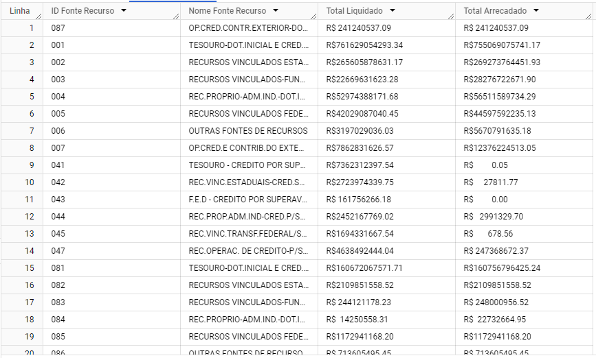
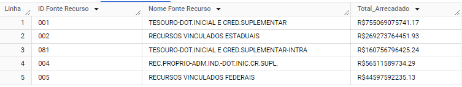
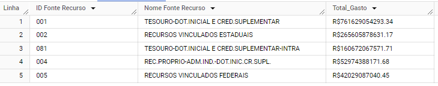
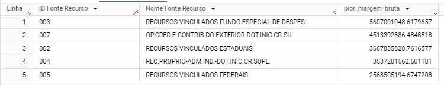
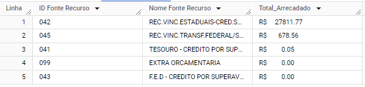
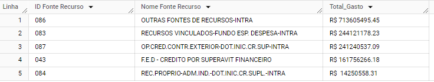
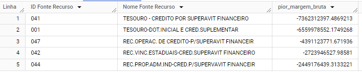
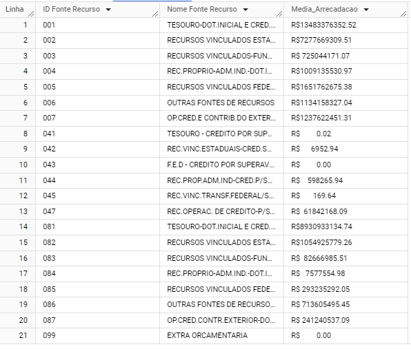

# karhub_project

O desafio consiste em desenvolver um ETL para processar arquivos que representam o orçamento do Estado de São Paulo de 2022 e armazená-los em um formato consistente para responder perguntas que ajudarão nosso time.
Os valores foram dolarizados com a cotação máxima do dolár do dia 22/06/2022.

## Build

    conda create -n karhub python=3.11 -y
    conda activate karhub
    pip install -r requirements.txt

## Run

    Adicionar na pasta das DAGs do seu Airflow e seja feliz !

# Respondendo as perguntas do projeto

# Quais são as 5 fontes de recursos que mais arrecadaram?

# Quais são as 5 fontes de recursos que mais gastaram?

# Quais são as 5 fontes de recursos com a melhor margem bruta?

# Quais são as 5 fontes de recursos que menos arrecadaram?

# Quais são as 5 fontes de recursos que menos gastaram?

# Quais são as 5 fontes de recursos com a pior margem bruta?

# Qual a média de arrecadação por fonte de recurso?

# Qual a média de gastos por fonte de recurso?

